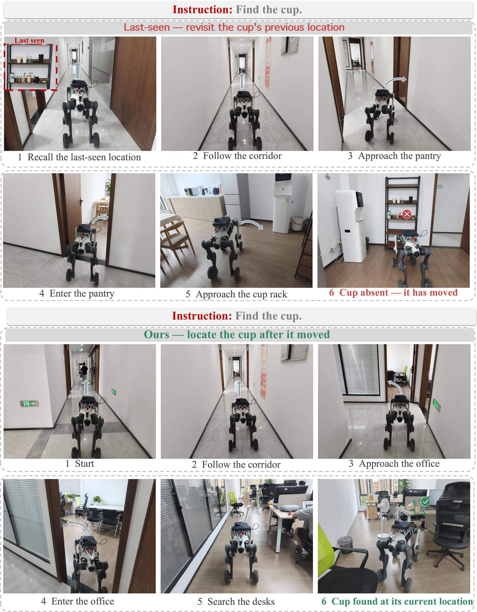
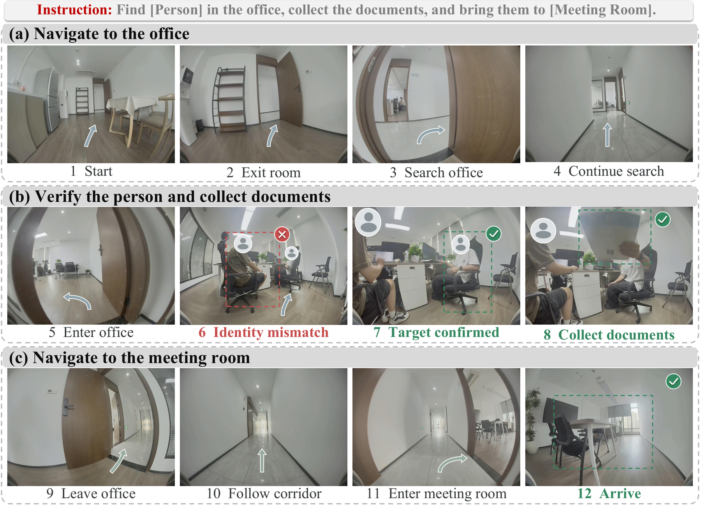
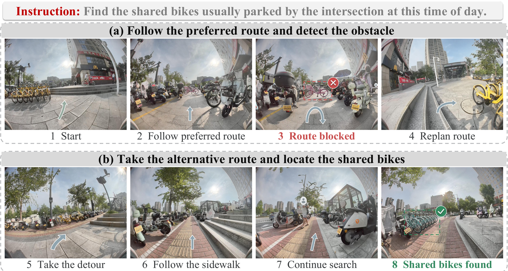

<h1 align="center">EvolvingNav</h1>

<p align="center">
  <b>Beyond the Remembered World: Predictive 4D Belief for Persistent Navigation in Evolving Worlds</b>
</p>

<p align="center">
  <a href="https://arxiv.org/pdf/2609.39166"></a>
  <a href="https://zju4embodiedai.github.io/EvolvingNav/"></a>
  <a href="https://github.com/ZJU4EmbodiedAI/EvolvingNav/tree/main/code"></a>
  <a href="https://huggingface.co/spaces/ZJU4EmbodiedAI/EvolvingNav"></a>
</p>

<p align="center">
  Mingjian Gao<sup>1,2,*</sup> &nbsp;·&nbsp;
  Zhaocheng Li<sup>1,2,*</sup> &nbsp;·&nbsp;
  Haoyang Huang<sup>1,3,*</sup> &nbsp;·&nbsp;
  Wenqiao Zhang<sup>2,‡</sup> &nbsp;·&nbsp;
  Yingjie Niu<sup>1,4,‡,†</sup> &nbsp;·&nbsp;
  Hao Zhou<sup>2</sup> &nbsp;·&nbsp;
  Chao Li<sup>1</sup> &nbsp;·&nbsp;
  Juncheng Li<sup>2</sup> &nbsp;·&nbsp;
  Siliang Tang<sup>2</sup> &nbsp;·&nbsp;
  Yueting Zhuang<sup>2</sup>
</p>

<p align="center">
  <sup>1</sup>Deeprobotics &nbsp;·&nbsp;
  <sup>2</sup>Zhejiang University &nbsp;·&nbsp;
  <sup>3</sup>University of California, San Diego &nbsp;·&nbsp;
  <sup>4</sup>The Chinese University of Hong Kong
</p>

<p align="center"><sub>* Equal contribution &nbsp;·&nbsp; ‡ Corresponding authors &nbsp;·&nbsp; † Project lead</sub></p>

<p align="center">
  <a href="#overview">Overview</a> &nbsp;·&nbsp;
  <a href="#key-idea">Key idea</a> &nbsp;·&nbsp;
  <a href="#evoworld-bench">EvoWorld-Bench</a> &nbsp;·&nbsp;
  <a href="#results">Results</a> &nbsp;·&nbsp;
  <a href="#getting-started">Getting started</a>
</p>

<p align="center">
  
</p>

<a id="overview"></a>
## 🌍 Overview

Robots often arrive in a world that no longer matches their last observation. A cup can be moved, a door can close, or an object can disappear while the agent is travelling. EvolvingNav treats this gap as a first-class part of navigation: it predicts what the world is likely to look like at arrival time, gathers evidence only when it is informative, and revises its plan when the evidence contradicts memory.

We introduce **EvoWorld-Bench**, a benchmark for persistent navigation in evolving 3D environments, and an event-driven agent that closes the loop between temporal memory, prediction, visibility-aware inspection, and replanning.

<p align="center">
  
  
  
</p>

## 🔍 Why EvolvingNav?

Most navigation systems treat an observation as a static fact. EvolvingNav separates three questions that are easy to conflate:

1. **Persistence:** is the last-seen state still likely to hold?
2. **Relocation:** if it changed, where could the object have moved under the observed routine?
3. **Evidence:** does a new view actually rule out a hypothesis, or was the object simply not visible?

This separation lets the agent use a stale memory as a calibrated prior rather than as a hard-coded map. The largest gains occur when the environmental change has learnable regularity; under uncertainty, the agent keeps multiple hypotheses and uses route observations to resolve them.

<a id="key-idea"></a>
## 💡 Key idea

<table>
  <tr>
    <td width="25%" align="center"><b>1 · Remember</b><br><sub>Build causal entity versions from timestamped RGB-D histories.</sub></td>
    <td width="25%" align="center"><b>2 · Predict</b><br><sub>Forecast persistence and relocation at candidate arrival times.</sub></td>
    <td width="25%" align="center"><b>3 · Inspect</b><br><sub>Use visibility and depth coverage to qualify new evidence.</sub></td>
    <td width="25%" align="center"><b>4 · Replan</b><br><sub>Update belief, memory, and the next action after informative views.</sub></td>
  </tr>
</table>

<p align="center">
  
</p>

The method combines a continuous-time history encoder, a persistence–relocation belief, an arrival-time filter, and a frozen zero-shot vision-language controller. The controller is invoked inside an event-driven loop: action, visibility-qualified observation, belief update, and route revision.

<a id="evoworld-bench"></a>
## 🧩 EvoWorld-Bench

EvoWorld-Bench turns human activity traces into executable evolving worlds. It preserves temporal histories, causal observability, controlled mobility regimes, and held-out transfer settings so that an agent cannot solve the task by treating the last observation as permanently true.

<table>
  <tr>
    <td width="50%" valign="top">
      <p align="center"><b>Figure 4 · Benchmark construction</b></p>
      <a href="figures/dataset-generate.pdf"></a>
      <p><sub>Human traces are normalized into a shared event schema, grounded in scenes, and instantiated as executable worlds.</sub></p>
    </td>
    <td width="50%" valign="top">
      <p align="center"><b>Figure 3 · Evaluation protocols</b></p>
      <a href="figures/P4D_Benchmark.pdf"></a>
      <p><sub>N1–N5 and EQA probe prediction, search, replanning, online dynamics, transfer, and embodied question answering.</sub></p>
    </td>
  </tr>
</table>

### 📌 Benchmark at a glance

| Dimension | Coverage |
| :-- | :-- |
| Scenes | **54** evolving indoor scenes |
| Tasks | **803,680** executable instances |
| World regimes | Static, routine, and random evolution with controlled mobility |
| Protocols | N1–N5 predictive navigation, search, replanning, online dynamics, and held-out transfer |
| Additional task | Embodied question answering (EQA) over evolving scenes |

The benchmark workflow is implemented in [`code/src/evoworld/`](code/src/evoworld/) and includes generation, native Habitat RGB-D histories, public/private audits, evaluation adapters, and release-layout export.

<a id="results"></a>
## 📊 Results

On EvoWorld-Bench, EvolvingNav improves both the first destination chosen from stale memory and recovery within a search budget. Values below are reported as mean ± standard deviation across five seeds.

| Metric | EvolvingNav |
| :-- | --: |
| First-Inspection Success Rate ↑ | **61.32 ± 3.24** |
| Search Success Rate ↑ | **86.18 ± 2.07** |
| SPL ↑ | **70.15 ± 1.74** |

<p align="center">
  
</p>

<p align="center"><sub>Qualitative behavior: arrival-time prediction proposes plausible destinations, while informative observations suppress stale hypotheses and trigger recovery.</sub></p>

### 🧪 Component analysis

<p align="center">
  
</p>

The ablation isolates the contribution of predictive belief, transition modeling, visibility-aware evidence, and event-driven replanning. Removing these components weakens either the initial inspection decision or the ability to recover after a world change.

## 🤖 Real-world validation

We evaluate the same persistent-navigation loop on **64 matched LYNX M20 search episodes**. Across indoor and outdoor scenes, the robot reaches **34.4% First-Inspection SR**, **48.4% Search SR**, and **24.3% Recovery SR**, with **43.8 m mean travel**. LYNX M20 is the primary quantitative platform; LYNX X30 and Lite3 provide matched transfer subsets with the same task protocol and perception interface.

<p align="center"><b>Figure 14 · Indoor cup search</b></p>
<p align="center">
  <a href="figures/Real_World_Case_third_3.pdf"></a>
</p>
<p align="center"><sub>Predictive belief reaches the cup after it moves, while the last-seen policy revisits a stale location.</sub></p>

<p align="center"><b>Figure 10 · Outdoor car search</b></p>
<p align="center">
  <a href="figures/Real_World_Case_third_1.pdf"></a>
</p>
<p align="center"><sub>The robot rejects the previous parking spot and searches for the car at its predicted current location.</sub></p>

### 🧭 Extended real-world executions

The paper also reports two longer-horizon executions that test system-level orchestration beyond the quantitative predictive-search protocol.

<p align="center">
  <a href="figures/Real_World_Case_1.pdf"></a>
</p>
<p align="center"><sub><b>Figure 15 · Indoor document delivery.</b> The robot navigates to an office, verifies a person, collects documents with human assistance, and delivers them to a meeting room.</sub></p>

<p align="center">
  <a href="figures/Real_World_Case_2.pdf"></a>
</p>
<p align="center"><sub><b>Figure 16 · Outdoor shared-bike search.</b> The robot detects a blocked preferred route, replans through a detour, and finds the shared bikes.</sub></p>

## 🎥 Demonstrations

The [project page](https://zju4embodiedai.github.io/EvolvingNav/) contains four HSSD videos plus HM3D and Habitat-GS demonstrations, an interactive HSSD belief explorer, benchmark figures, and the full paper narrative. An interactive lightweight demo is also available on [Hugging Face](https://huggingface.co/spaces/ZJU4EmbodiedAI/EvolvingNav).

## 🗂️ Repository layout

```text
.
├── index.html                 # Research project page
├── figures/                   # Paper figures and web-ready previews
├── assets/                    # Interactive explorer assets
├── main.pdf                   # Repository copy of the manuscript
└── code/
    ├── evolvingnav/           # Agent, memory, filter, controller, and Habitat runner
    ├── src/evoworld/          # EvoWorld-Bench generation and evaluation workflow
    ├── scripts/               # Dataset, training, calibration, and native rollouts
    ├── configs/               # Perception and benchmark configurations
    └── tests/                 # Agent and benchmark contract tests
```

<a id="getting-started"></a>
## 🛠️ Getting started

The runnable implementation lives in [`code/`](code/README.md). It targets **Python 3.11** and **Habitat-Sim 0.3.3**.

```bash
git clone https://github.com/ZJU4EmbodiedAI/EvolvingNav.git
cd EvolvingNav/code

python -m venv .venv
source .venv/bin/activate
python -m pip install -r requirements.txt

export PYTHONPATH=.:src:scripts
python -m pytest tests -q
```

For dataset paths, RGB-D assets, model checkpoints, calibration, training, and N1–N5 execution commands, see the detailed [code README](code/README.md). The source tree keeps generated datasets, run logs, checkpoints, and credentials outside version control.

## 📖 Citation

If EvolvingNav is useful for your research, please cite:

```bibtex
@article{gao2026evolvingnav,
  title   = {Beyond the Remembered World: Predictive 4D Belief for Persistent Navigation in Evolving Worlds},
  author  = {Gao, Mingjian and Li, Zhaocheng and Huang, Haoyang and Zhang, Wenqiao and Niu, Yingjie and Zhou, Hao and Li, Chao and Li, Juncheng and Tang, Siliang and Zhuang, Yueting},
  journal = {arXiv preprint arXiv:2609.39166},
  year    = {2026}
}
```

## 🔗 Links

- **Paper:** [arXiv:2609.39166](https://arxiv.org/pdf/2609.39166)
- **Project page:** [zju4embodiedai.github.io/EvolvingNav](https://zju4embodiedai.github.io/EvolvingNav/)
- **Code:** [github.com/ZJU4EmbodiedAI/EvolvingNav/tree/main/code](https://github.com/ZJU4EmbodiedAI/EvolvingNav/tree/main/code)
- **Interactive demo:** [Hugging Face Space](https://huggingface.co/spaces/ZJU4EmbodiedAI/EvolvingNav)
